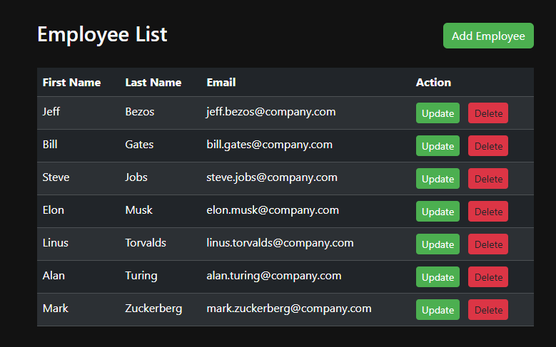

## Employee-MVC-CRUD
***

A Spring Boot CRUD application for managing employees with Spring MVC + Thymeleaf UI, Spring Data JPA, and PostgreSQL.
It also demonstrates the use of Spring AOP for logging cross-cutting concerns across controllers, services, and DAOs.



---
### Technologies

- Java 17
- Spring Boot 3.3.0
- Spring Data JPA
- Spring MVC + Thymeleaf
- Spring AOP
- PostgreSQL
- Maven

---
### Project Structure

- `entity/Employee` – JPA entity representing an employee.

- `dao/EmployeeRepository` – extends JpaRepository<Employee, Long>.

- `service/EmployeeService` – business logic for CRUD operations.

- `controller/EmployeeController` – MVC controller handling web requests and returning Thymeleaf views.

- `aspect/LoggingAspect` – AOP aspect that logs method calls and return values in DAO, service, and controller layers.

- `sql-scripts/employee-directory.sql` – schema and initial data for the PostgreSQL database.

---
### Features

- List all employees (`GET /employees`).
- Show employee details.
- Add a new employee.
- Update existing employee.
- Delete employee.
- Logging of all DAO, service, and controller methods via AOP.

---
### Running the Application

1. Create the database and run `sql-scripts/employee-directory.sql`.

2. Adjust application.properties with your PostgreSQL credentials.

3. Start the app:
```
mvn spring-boot:run
```
4. Access in browser:

http://localhost:8080/employees