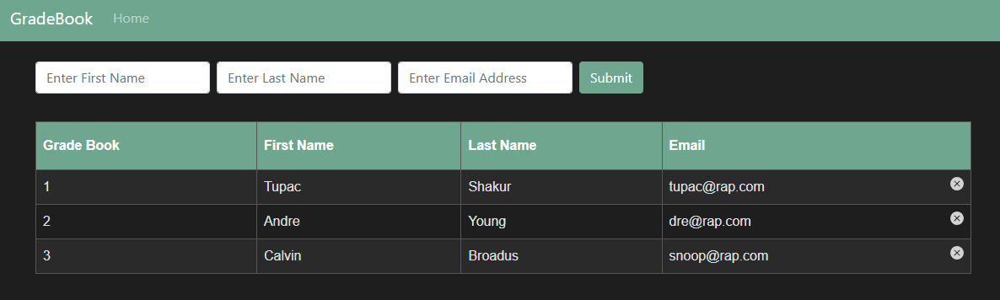

## 📚 Gradebook

A sample **Spring Boot MVC + JPA + H2** project built using the **Test-Driven Development (TDD)** approach.  
This application was created as a way to learn and practice TDD by building features step by step with tests first.



It allows you to manage students, their grades in different subjects, and view detailed grade information.  
The project includes **unit and integration tests** with JUnit 5, Mockito, and MockMvc.

---

### Features

- Developed with **TDD (Test-Driven Development)**.
- Manage students (add, list, delete).
- Assign and remove grades for **Math**, **Science**, and **History**.
- View detailed student information with aggregated grades.
- In-memory **H2 Database** for testing and development.
- REST endpoints tested with **MockMvc**.

### Tech Stack

- **Java 24**
- **Spring Boot 3.5.5**
    - spring-boot-starter-web (Spring MVC)
    - spring-boot-starter-thymeleaf (view templates)
    - spring-boot-starter-data-jpa
- **Databases**
    - H2 (in-memory, development & testing)
    - PostgreSQL (runtime support)
- **Testing**
    - spring-boot-starter-test (JUnit 5, Mockito, Spring Test)
- **Build Tool**
    - Maven + Spring Boot Maven Plugin

### Endpoints

GET `/` → List all students.

POST `/` → Create a new student.

GET `/delete/student/{id}` → Delete student by ID.

GET `/studentInformation/{id}` → Detailed student info.

POST `/grades` → Add a grade to a student.

GET `/grades/{id}/{gradeType}` → Delete a specific grade.

### Testing

This project was developed following Test-Driven Development (TDD) principles, and the test suite ensures that all core functionalities of the application are correctly implemented and robust. The tests are written using **Spring Boot Test**, **JUnit 5**, **Mockito**, and **MockMvc**, covering both the service and controller layers.

- **Controller Tests** (`GradebookControllerTest`): 

Verify the behavior of HTTP endpoints, including creating, deleting, and fetching students and grades. These tests validate the correct HTTP response status, rendered views, and model attributes, as well as the persistence of data in the database. They also check for proper handling of invalid requests, non-existent students, and invalid grades.

- **Service Tests** (`StudentAndGradeServiceTest`): 

Focus on business logic by testing all service methods, such as creating and deleting students, adding or removing grades, checking student existence, and retrieving detailed student information. Tests ensure proper interaction with the database and verify correct behavior for valid, invalid, and edge-case inputs.

All tests are designed to be isolated and repeatable, with database state reset before and after each test. This guarantees consistent results and enforces reliable application behavior.


### Databases

The project uses different databases depending on the environment:

- Production environment (**PostgreSQL**)
The application connects to PostgreSQL, and the schema and initial data are loaded from the schema.sql and data.sql files. This allows automatic creation of tables and insertion of sample records on the first application startup. Connection properties are configured in application.properties.

- Test environment (**H2**)
Unit and integration tests use an in-memory H2 database, which keeps tests fast and isolated from the production database. SQL scripts are not loaded during tests to prevent overwriting test data.

#### Notes

The schema.sql and data.sql files are only executed when running the application in production or locally with **PostgreSQL**.

Tests annotated with `@SpringBootTest` use H2 and do not affect the real **PostgreSQL** data.

### Running the Application

1. Build the project.

Use Maven to compile the code and download dependencies:
```
mvn clean install
```
2. Configure the database

Make sure PostgreSQL is running and accessible with the credentials defined in application.properties. The first time the application starts, it will create tables and insert sample data using `schema.sql` and `data.sql`.

3. Run the application

```
mvn spring-boot:run
```

The application will be available at http://localhost:1500.

Running tests
Tests run against an in-memory H2 database and do not affect your PostgreSQL instance:
```
mvn test
```